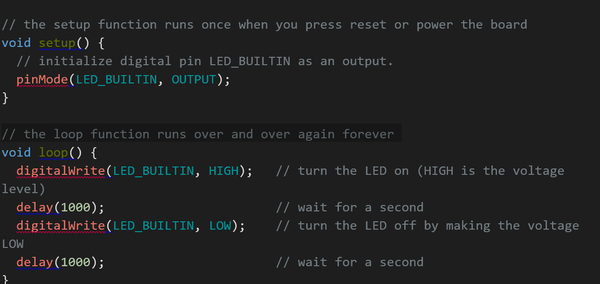
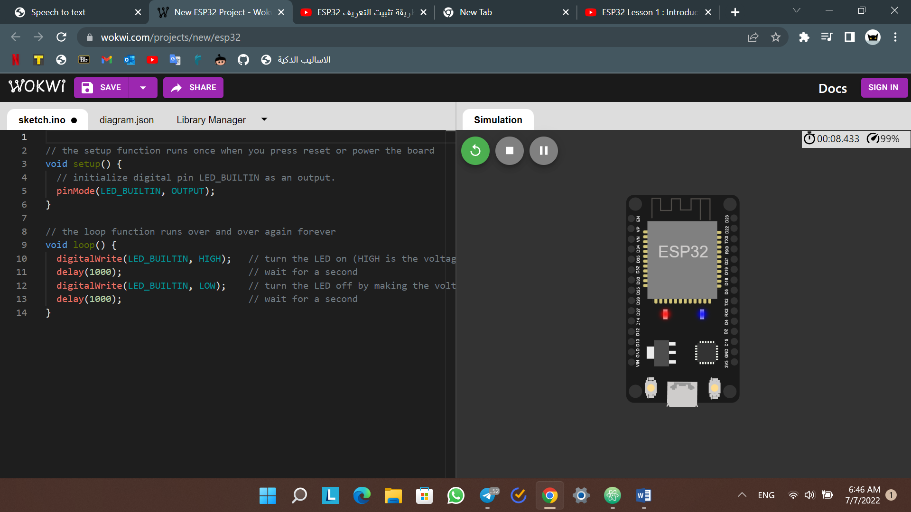

# Smart_Methods_IOT_task1
This repository contains all the required tasks of week2 in IOT / Smart Methods.
# Synopsis:
### TASK 1 :
 Web page Speech to text using html,css,javascript in both Arabic and English ( Example : https://s-m.com.sa/r2/test/ )
###  TASK 2 : 
Write Algorithm for running Wasdom ESP32
## Requirements: 
-	Install Arduino IDE
-	Preparing the ESP32 Board in Arduino IDE 
## Steps:
1. Plug the ESP32 to your PC or laptob by using micro cable.
2. Then click on a file > preferences , put the package link to the esp32 https://dl.espressif.com/dl/package_esp32_index.json > ok
3. Go to Tools > Board > Boards Manager > from the search bar write "esp32" > click on install.
4. Go to Tools > Board > select the name of your ESP32 board.
5. Go to Tools > Port and select a COM port available.
6. write the following code in arduion editor :

7.  Press the upload button.
> NOTE : I USE https://wokwi.com/projects/new/esp32 TO MAKE SURE THE CODE WORK

Output sample for Task 1:
 [here](output task1 ar.png)
[here](output task1 en.png)
 
Output sample for Task 2:
 

Learning references
1.	https://www.youtube.com/watch?v=rwB6RqqCmXc&t=3s
2.	https://www.youtube.com/watch?v=_eXEfX1KToo&t=105s
3.	https://www.w3schools.com/css/default.asp
4.	https://www.w3schools.com/html/default.asp
5.	https://www.w3schools.com/js/default.asp
6.	https://www.youtube.com/watch?v=mBaS3YnqDaU&t=10s
7.	https://www.youtube.com/watch?v=h8iHRy48a8I

